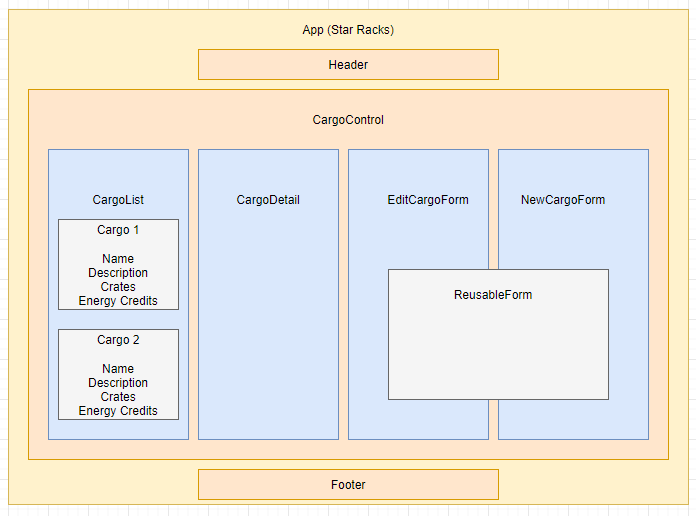
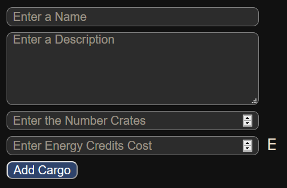
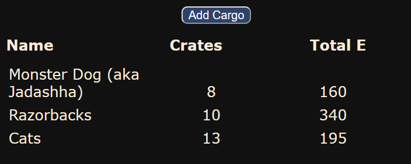
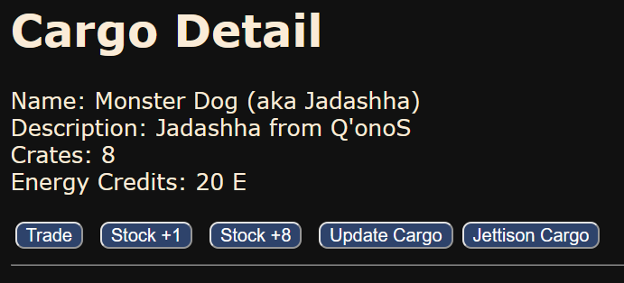

<br>
<p align="center">
  <u><big>|| <b>Star Racks 2  </b> ||</big></u>
  <p>Rath of Redux</p>
</p>
<p align="center">
    <!-- Project Avatar/Logo -->
    <br>
     <a href="https://github.com/mmanchee/StarRacks2">
        
    </a>
    <p align="center">
      ___________________________
    </p>
    <!-- GitHub Link -->
    <p align="center">
        <a href="https://github.com/mmanchee">
            <strong>Mike Manchee</strong>
        </a>
    </p>
    <!-- Project Shields -->
    <p align="center">
        <a href="https://github.com/mmanchee/StarRacks2/graphs/contributors">
            
        </a>
        ¨
        <a href="https://github.com/mmanchee/StarRacks2/stargazers">
            
        </a>
        ¨
        <a href="https://github.com/mmanchee/StarRacks2/issues">
            
        </a>
        ¨
        <a href="https://github.com/mmanchee/StarRacks2/blob/master/LICENSE.txt">
            
        </a>
        ¨
    </p>
</p>
<p align="center">
  <small>Initiated 11/20/2020.</small>
</p>

<!-- Project Links -->
<p align="center">
    <a href="https://github.com/mmanchee/StarRacks2"><big>Project Docs</big></a> ·
    <a href="https://github.com/mmanchee/StarRacks2/issues"><big>Report Bug</big></a> ·
    <a href="https://github.com/mmanchee/StarRacks2/issues"><big>Request Feature</big></a>
</p>
------------------------------

### <u>Table of Contents</u>
* <a href="#🌐-about-the-project">About the Project</a>
    * <a href="#📖-description">Description</a>
    * <a href="#🦠-known-bugs">Known Bugs</a>
    * <a href="#🛠-built-with">Built With</a>
* <a href="#🏁-getting-started">Getting Started</a>
    * <a href="#📋-prerequisites">Prerequisites</a>
    * <a href="#⚙️-setup-and-use">Setup and Use</a>
* <a href="#🔍-preview">Preview</a>
* <a href="#🤝-contributors">Auxiliary</a>
    * <a href="#🤝-contributors">Contributors</a>
    * <a href="#✉️-contact-and-support">Contact</a>
    * <a href="#⚖️-license">License</a>
    * <a href="#🌟-acknowledgements">Acknowledgements</a>
    
------------------------------
## 🌐 About the Project

### 📖 Description
Star Racks 2 - Rath of the Crates
Capitan, it's time for a journey of discovery and trade, again. This time we have a new Quantum AI Operation Control (Redux) that was integrated on the last ship refitting. SO, (queue scifi scroll) We are, again, taking our 24th Century Intergalactic Alcubierre Warp Vessel (spaceship) on an adventure around the galaxy. Trade our goods for Energy Credits (E) and seeing some more new places along the way, like the water based ships of a millennium ago. We will pick up some goods on Earth and make our way across the stars, selling and stocking goods from every planet. Unfortunately our Spatial Matter Calibrator (shrinkray) is still broken (you think that would have been the first thing they refitted ... but the Fleet is all about this new Redux thing ... ), so we only have room in the cargo hold for 32 Thermoplastic Liqui-Tite Modules (crates) of trade goods per slot. Diversification of our cargo is still the key to more Credits, so we only want to stock one item per slot at a time. The hold has 20 slots for all the trade goods. So what do you say say Captain... Engage! (queue scifi music)

<!-- Brainstorm
refactor with redux and tests

 -->
### 🦠 Known Bugs

* There are no known bugs at this time.
### 🛠 Built With
* [Visual Studio Code](https://code.visualstudio.com/)
* [Javascript](https://developer.mozilla.org/en-US/docs/Web/JavaScript)
* [Reactjs](https://reactjs.org/)
<!-- ### 🔍 Preview -->

------------------------------

## 🏁 Design

<a href="https://github.com/mmanchee/StarRacks2">
    
</a>

### 📋 Prerequisites

 #### Code Editor

  To view or edit the code, you will need an code editor or text editor. The popular open-source choices for an code editor are Atom and VisualStudio Code.

  1) Code Editor Download:
     * [VisualStudio Code](https://www.npmjs.com/)
  2) Click the download most applicable to your OS and system.
  3) Wait for download to complete, then install -- Windows will run the setup exe and macOS will drag and drop into applications.
  4) Optionally, create a [GitHub Account](https://github.com)

### ⚙️ Setup and Use

  #### Download option
  * Download files from GitHub repository by click Code and Download Zip
  * Extract files into a single directory 
  * Run GitBASH in directory
    * Type "npm install" - to install Node Package Manager and additional files
    * Type "npm run start" - to open compiled browser and view project
  * Have fun with The Exchange!

  #### Cloning options
  * For cloning please use the following GitHub [tutorial](https://docs.github.com/en/enterprise/2.16/user/github/creating-cloning-and-archiving-repositories/cloning-a-repository)
  * Place files into a single directory 
  * Run GitBASH in directory
    * Type "npm install" - to install Node Package Manager and additional files
    * Type "npm run start" - to open compiled browser and view project
  * Have fun with The Exchange!

### 🔍 Preview

* The app has features to add cargo.


* The app allows you to see a list of cargo


* The app allows for details and adding or subtracting quantities, as well as editing or deleting cargo.


### 🤝 Contributors

| Author | GitHub | Email |
|--------|:------:|:-----:|
| [Mike Manchee](https://www.linkedin.com/in/mikemanchee/) | [mmanchee](https://github.com/mmanchee) |  [mikemanchee@gmail.com](mailto:mikemanchee@gmail.com) |

------------------------------

### ✉️ Contact and Support

If you have any feedback or concerns, please contact one of the contributors.

------------------------------

### Links

  #### Learn More

  You can learn more in the [Create React App documentation](https://facebook.github.io/create-react-app/docs/getting-started).

### ⚖️ License

This project is licensed under the [MIT License](https://opensource.org/licenses/MIT). Copyright (C) 2020 Daniel Schaaf and William Donovan-Seid. All Rights Reserved.
```
MIT License

Copyright (c) 2020 **Mike Manchee**

Permission is hereby granted, free of charge, to any person obtaining a copy
of this software and associated documentation files (the "Software"), to deal
in the Software without restriction, including without limitation the rights
to use, copy, modify, merge, publish, distribute, sublicense, and/or sell
copies of the Software, and to permit persons to whom the Software is
furnished to do so, subject to the following conditions:

The above copyright notice and this permission notice shall be included in all
copies or substantial portions of the Software.

THE SOFTWARE IS PROVIDED "AS IS", WITHOUT WARRANTY OF ANY KIND, EXPRESS OR
IMPLIED, INCLUDING BUT NOT LIMITED TO THE WARRANTIES OF MERCHANTABILITY,
FITNESS FOR A PARTICULAR PURPOSE AND NONINFRINGEMENT. IN NO EVENT SHALL THE
AUTHORS OR COPYRIGHT HOLDERS BE LIABLE FOR ANY CLAIM, DAMAGES OR OTHER
LIABILITY, WHETHER IN AN ACTION OF CONTRACT, TORT OR OTHERWISE, ARISING FROM,
OUT OF OR IN CONNECTION WITH THE SOFTWARE OR THE USE OR OTHER DEALINGS IN THE
SOFTWARE.
```

------------------------------

### 🌟 Acknowledgments

#### [Epicodus](https://www.epicodus.com/)
>"A school for tech careers... to help people learn the skills they need to get great jobs."

#### [The Internet](https://lh3.googleusercontent.com/proxy/6QlFHq-RHi9-Jd7pjdpwFdWMTYy5y26LesKZG-TO7rD3ZCh2BESLUzktpd27TAXSiGd19f8B3AxMn5Nbos1g6QCHAQOTrvVsAVnqS7RKSCQLV6s)
> "...The Internet is becoming the town square for the global village of tomorrow..."
> - Bill Gates

------------------------------

<center><a href="#">Return to Top</a></center>